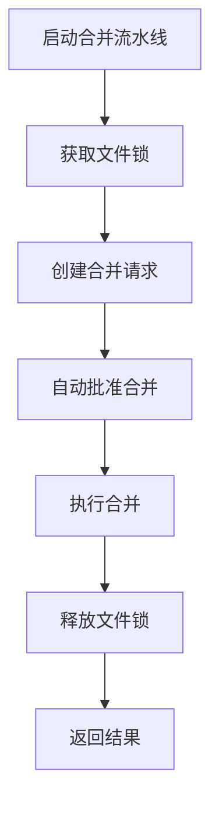

# GitLab分支合并流水线使用指南

## 🎯 概述

本系统提供完整的 GitLab 分支自动合并功能，能够自动创建合并请求并批准合并到目标分支，支持单分支合并和批量分支合并两种模式。

**核心特性**:
- ✅ 自动创建合并请求
- ✅ 自动批准并合并
- ✅ 批量分支处理
- ✅ 文件锁防并发
- ✅ 灵活的合并配置

## 🏗️ 系统架构



## 🚀 快速开始

### 1. 环境准备

确保已配置 GitLab 环境变量：

```bash
# GitLab配置（必需）
export GITLAB_URL="https://gitlab.example.com"
export GITLAB_TOKEN="your-gitlab-token"
export GITLAB_PROJECT_ID="your-project-id"

# 或在config/gitlab_config.py中配置
```

### 2. 基本使用

#### 单分支合并
```bash
python automation/gitlab_branch_merge_pipeline.py \
  --project-id 93 \
  --source-branch feature/new-feature \
  --target-branch main
```

#### 带标题和描述的合并
```bash
python automation/gitlab_branch_merge_pipeline.py \
  --project-id 93 \
  --source-branch feature/new-feature \
  --target-branch main \
  --title "合并新功能到主分支" \
  --description "包含用户管理功能和API优化" \
  --assignee-id 123 \
  --reviewer-ids 456 789 \
  --labels "auto-merge feature"
```

#### 仅创建MR（不自动合并）
```bash
python automation/gitlab_branch_merge_pipeline.py \
  --project-id 93 \
  --source-branch feature/new-feature \
  --target-branch main \
  --no-auto-merge
```

#### 合并后删除源分支
```bash
python automation/gitlab_branch_merge_pipeline.py \
  --project-id 93 \
  --source-branch feature/old-feature \
  --target-branch main \
  --remove-source-branch
```

## 📚 详细使用示例

### 1. 开发工作流 - 功能分支合并

在完成功能开发后，将 feature 分支合并到 main 分支：

```bash
# 合并单个功能分支
python automation/gitlab_branch_merge_pipeline.py \
  --project-id 93 \
  --source-branch feature/user-management \
  --target-branch main \
  --title "User Management Feature" \
  --description "实现用户注册、登录、权限管理功能" \
  --assignee-id 123 \
  --reviewer-ids 456 789 \
  --labels "feature user-management" \
  --merge-commit-message "feat: 用户管理功能开发完成"
```

### 2. 发布流程 - Release分支合并

将 release 分支合并到 main 分支，并标记为发布：

```bash
python automation/gitlab_branch_merge_pipeline.py \
  --project-id 93 \
  --source-branch release/v2.1.0 \
  --target-branch main \
  --title "Release v2.1.0" \
  --description "发布版本2.1.0，包含bug修复和性能优化" \
  --labels "release v2.1.0" \
  --squash
```

### 3. 批量合并热修复分支

在紧急修复场景下，批量合并多个 hotfix 分支：

```bash
# 创建分支列表文件
cat > hotfix_branches.txt << EOF
hotfix/login-issue
hotfix/database-timeout
hotfix/memory-leak
EOF

# 批量合并
python automation/gitlab_branch_merge_pipeline.py \
  --project-id 93 \
  --source-branch dummy \
  --batch-mode \
  --branches-file hotfix_branches.txt \
  --target-branch main \
  --title "Hotfix Batch Merge" \
  --labels "hotfix urgent"
```

### 4. 从标准输入批量合并

```bash
# 从管道读取分支列表
echo -e "feature/abc\nfeature/xyz\nfeature/123" | \
python automation/gitlab_branch_merge_pipeline.py \
  --project-id 93 \
  --source-branch dummy \
  --batch-mode \
  --target-branch develop \
  --title "Batch Feature Merge" \
  --assignee-id 123 \
  --no-squash
```

### 5. 交互式合并（手动审查）

创建 MR 后手动审查，再执行合并：

```bash
# 步骤1: 创建MR（不自动合并）
python automation/gitlab_branch_merge_pipeline.py \
  --project-id 93 \
  --source-branch feature/large-feature \
  --target-branch main \
  --no-auto-merge

# 步骤2: 手动审查MR...

# 步骤3: 执行合并
python automation/gitlab_branch_merge_pipeline.py \
  --project-id 93 \
  --source-branch feature/large-feature \
  --target-branch main \
  --mr-iid 123  # 指定MR ID进行合并
```

## 📖 命令行参数详解

### 必需参数
- `--project-id`: GitLab项目ID
- `--source-branch`: 源分支名称

### 目标分支配置
- `--target-branch` (默认: main): 目标分支名称

### MR配置
- `--title`: 合并请求标题（可选，默认: "Merge {source_branch} into {target_branch}"）
- `--description`: 合并请求描述（可选）
- `--assignee-id`: 指派给的用户ID（可选）
- `--reviewer-ids`: 审查者用户ID列表（可选，多个ID用空格分隔）
- `--labels`: 标签列表（可选，多个标签用空格分隔）

### 合并配置
- `--merge-commit-message`: 合并提交消息（可选）
- `--remove-source-branch`: 合并后删除源分支（可选标志）
- `--no-squash`: 不压缩提交（可选标志）

### 模式选择
- `--no-auto-merge`: 不自动合并（仅创建MR，可选标志）
- `--batch-mode`: 批量模式（从文件或标准输入读取分支列表）
- `--branches-file`: 分支列表文件路径（与 `--batch-mode` 配合使用）

### 其他配置
- `--log-level` (默认: INFO): 日志级别 (DEBUG, INFO, WARNING, ERROR)
- `--lock-timeout` (默认: 0): 锁等待超时时间（秒），0表示不等待，-1表示无限等待

## 🔧 高级配置

### 文件锁机制

系统使用文件锁防止并发合并冲突：

```bash
# 等待锁释放（超时60秒）
python automation/gitlab_branch_merge_pipeline.py \
  --project-id 93 \
  --source-branch feature/test \
  --lock-timeout 60

# 跳过锁检查（不推荐）
python automation/gitlab_branch_merge_pipeline.py \
  --project-id 93 \
  --source-branch feature/test \
  --no-lock  # 注意：此参数未实现，需手动修改脚本
```

### 批量合并最佳实践

1. **使用文件管理分支列表**
```bash
# 创建有序的分支列表
cat > branches_ordered.txt << EOF
feature/dependency-update
feature/performance-optimization
feature/ui-enhancement
EOF

# 批量合并（按顺序）
python automation/gitlab_branch_merge_pipeline.py \
  --project-id 93 \
  --source-branch dummy \
  --batch-mode \
  --branches-file branches_ordered.txt \
  --target-branch main
```

2. **过滤分支**
```bash
# 从Git获取分支列表并过滤
git branch -r | grep "feature/" | awk '{print $1}' | sed 's/^origin\///' > feature_branches.txt

# 批量合并筛选后的分支
python automation/gitlab_branch_merge_pipeline.py \
  --project-id 93 \
  --source-branch dummy \
  --batch-mode \
  --branches-file feature_branches.txt
```

### CI/CD集成

在GitLab CI中集成分支合并：

```yaml
# .gitlab-ci.yml
merge-to-main:
  stage: deploy
  script:
    - python automation/gitlab_branch_merge_pipeline.py
      --project-id $CI_PROJECT_ID
      --source-branch $CI_COMMIT_REF_NAME
      --target-branch main
      --title "Auto-merge from CI"
      --merge-commit-message "Merge $CI_COMMIT_REF_NAME via CI"
  only:
    - triggers
```

## 📊 输出示例

### 成功输出
```
✅ 分支合并成功
  项目ID: 93
  分支: feature/new-feature -> main
  MR: !123 - 合并新功能分支
  链接: https://gitlab.com/project/repo/-/merge_requests/123
  状态: ✅ 自动合并成功
  执行时间: 5.23s
```

### 批量合并输出
```
📊 批量合并完成，共 3 个分支
  ✅ feature/branch1 -> main
  ✅ feature/branch2 -> main
  ❌ feature/branch3 失败: 分支不存在
```

### 失败输出
```
❌ 分支合并失败
  错误: 源分支不存在
  执行时间: 1.45s
```

## ⚙️ 配置管理

### 环境变量配置

```bash
# .env
GITLAB_URL=https://gitlab.example.com
GITLAB_TOKEN=glpat-xxxxxxxxxxxx
GITLAB_PROJECT_ID=93
```

### 配置文件

在 `config/gitlab_config.py` 中配置默认参数：

```python
# config/gitlab_config.py
class GitLabConfig:
    default_target_branch = "main"
    default_auto_merge = True
    default_remove_source_branch = False
    default_squash = False
```

## 🐛 故障排除

### 常见错误

1. **认证失败**
```
GitLab认证失败: Invalid token
```
**解决方案**: 检查 `GITLAB_TOKEN` 是否有效

2. **分支不存在**
```
创建合并请求失败: Source branch does not exist
```
**解决方案**: 确认源分支名称正确且已推送到远程仓库

3. **并发锁冲突**
```
GitLab分支合并流水线正在运行，请稍后再试
```
**解决方案**: 等待当前合并完成，或使用 `--lock-timeout` 设置等待时间

4. **权限不足**
```
审批并合并失败: Insufficient permissions
```
**解决方案**: 确保GitLab token有 `merge_merge_requests` 和 `approve_merge_request` 权限

### 调试模式

启用详细日志查看更多信息：

```bash
python automation/gitlab_branch_merge_pipeline.py \
  --project-id 93 \
  --source-branch feature/test \
  --log-level DEBUG
```

### 验证合并前检查

在生产环境使用前，建议先测试：

```bash
# 测试模式（仅创建MR，不合并）
python automation/gitlab_branch_merge_pipeline.py \
  --project-id 93 \
  --source-branch feature/test \
  --no-auto-merge \
  --log-level INFO

# 检查MR后手动合并
```

## 🔗 相关文档

- [GitLab MR自动审查系统](./mr_review_guide.md)
- [SonarQube代码质量分析](./sonarqube_analyzer_guide.md)
- [SQL项目扫描器](./sql_scanner.md)
- [ProjectMind-AI项目指南](./PROJECT_GUIDE.md)

## 📝 更新日志

### v1.0.0 (2025-11-04)
- ✨ 初始版本
- ✅ 支持单分支自动合并
- ✅ 支持批量分支合并
- ✅ 集成文件锁机制
- ✅ 完整的命令行参数支持
