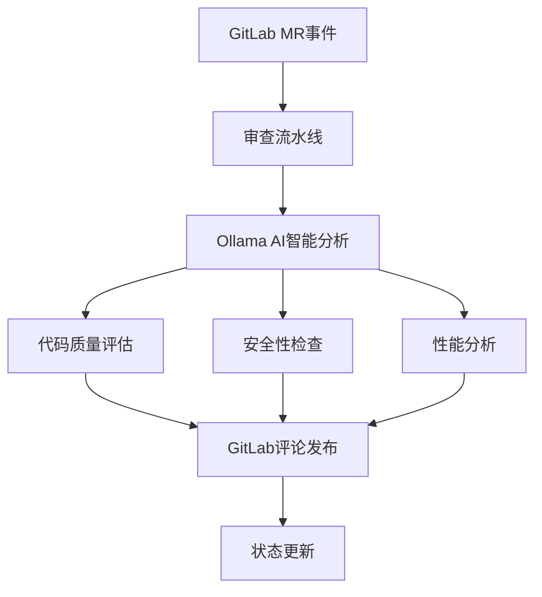

# GitLab MR 自动审查系统使用指南

## 🎯 概述

本系统基于 Python Scripts Manager 构建，提供完整的 GitLab MR 自动审查功能，基于 Ollama AI 智能分析代码质量和安全性。

**重要提示**: 系统默认不会阻断合并请求，只会在 MR 评论区发布审查报告和添加标签。如需启用阻断功能，请设置 `auto_block: true`。

## 🏗️ 系统架构



## 🚀 快速开始

### 1. 环境准备

```bash
# 安装依赖
cd /Users/xuan/worksapce/manager/backend/python-scripts
pip install -r requirements.txt

# 配置环境变量
export GITLAB_URL="https://gitlab.example.com"
export GITLAB_TOKEN="your-gitlab-token"
export GITLAB_PROJECT_ID="your-project-id"

export OLLAMA_URL="http://localhost:11434"
export OLLAMA_MODEL="codellama"
```

### 2. 配置文件

复制并修改配置文件：

```bash
cp examples/review_config_example.json config/review_config.json
```

#### 多项目配置结构

新版本支持多项目配置，配置文件结构如下：

```json
{
  "global_config": {
    "enable": true,
    "auto_trigger": true,
    "concurrent_reviews": 3,
    "default_ai_model": "codellama"
  },
  "projects": {
    "web-app": {
      "gitlab_project_id": 123,
      "enable": true,
      "ai_config": { ... },
      "review_rules": { ... },
      "gitlab_config": { ... },
      "notification_config": { ... },
      "custom_rules": { ... }
    },
    "api-service": {
      "gitlab_project_id": 456,
      "enable": true,
      // 项目特定配置
    }
  }
}
```

### 3. 基本使用

#### 审查单个MR
```bash
# 使用项目ID
python examples/mr_review_pipeline.py \
  --project-id 123 \
  --mr-iid 45 \
  --log-level INFO

# 使用项目名称（推荐）
python examples/mr_review_pipeline.py \
  --project-name web-app \
  --mr-iid 45 \
  --log-level INFO
```

#### 审查所有开放的MR
```bash
# 单个项目
python examples/mr_review_pipeline.py \
  --project-name web-app \
  --all \
  --log-level INFO

# 所有项目
python examples/mr_review_pipeline.py \
  --all-projects \
  --log-level INFO
```

#### 监控模式
```bash
# 监控单个项目
python examples/mr_review_pipeline.py \
  --project-name web-app \
  --monitor \
  --interval 300 \
  --max-reviews 10

# 监控所有项目
python examples/mr_review_pipeline.py \
  --all-projects \
  --monitor \
  --interval 300 \
  --max-reviews 20
```

#### 指定AI模型和参数
```bash
# 使用指定AI模型审查
python examples/mr_review_pipeline.py \
  --project-name web-app \
  --mr-iid 45 \
  --ai-model llama3 \
  --log-level INFO

# 使用指定AI模型并调整温度参数
python examples/mr_review_pipeline.py \
  --project-name web-app \
  --all \
  --ai-model qwen:32b \
  --ai-temperature 0.5 \
  --log-level INFO

# 多项目审查使用指定AI模型
python examples/mr_review_pipeline.py \
  --all-projects \
  --ai-model codellama \
  --ai-temperature 0.2 \
  --log-level INFO
```

## 📋 详细使用指南

### 1. 实际使用示例

#### 强制重新评论示例
```bash
# 强制重新评论单个MR（忽略已有评论）
python examples/mr_review_pipeline.py \
  --project-name web-app \
  --mr-iid 45 \
  --force-recomment \
  --log-level INFO

# 强制重新评论项目的所有MR
python examples/mr_review_pipeline.py \
  --project-name web-app \
  --all \
  --force-recomment \
  --log-level INFO

# 强制重新评论所有项目的所有MR
python examples/mr_review_pipeline.py \
  --all-projects \
  --force-recomment \
  --log-level INFO
```

#### CI/CD集成中的强制重新评论
```yaml
stages:
  - review

mr_review:
  stage: review
  script:
    - python examples/mr_review_pipeline.py 
      --project-name web-app 
      --mr-iid $CI_MERGE_REQUEST_IID
      --force-recomment
  only:
    - merge_requests
  allow_failure: true
```

#### 结合AI模型优化的强制重新评论
```bash
# 使用高精度模型强制重新评论重要项目
python examples/mr_review_pipeline.py \
  --project-name critical-project \
  --mr-iid 45 \
  --force-recomment \
  --ai-model llama3:70b \
  --ai-temperature 0.1 \
  --log-level INFO

# 使用快速模型批量强制重新评论
python examples/mr_review_pipeline.py \
  --project-name web-app \
  --all \
  --force-recomment \
  --ai-model mistral \
  --ai-temperature 0.3 \
  --log-level INFO
```

### 2. 命令行参数

| 参数 | 说明 | 示例 |
|------|------|------|
| `--project-id` | GitLab项目ID | `--project-id 123` |
| `--project-name` | 项目名称（推荐） | `--project-name web-app` |
| `--mr-iid` | 审查单个MR的IID | `--mr-iid 45` |
| `--all` | 审查指定项目所有开放的MR | `--all` |
| `--all-projects` | 审查所有项目所有开放的MR | `--all-projects` |
| `--monitor` | 启用监控模式 | `--monitor` |
| `--config` | 配置文件路径 | `--config config/review_config.json` |
| `--output` | 输出报告文件 | `--output report.html` |
| `--log-level` | 日志级别 | `--log-level DEBUG` |
| `--ai-model` | 指定AI模型（覆盖配置文件） | `--ai-model llama3` |
| `--ai-temperature` | 指定AI温度参数（0.0-1.0） | `--ai-temperature 0.5` |
| `--project-filter` | 项目过滤器（正则表达式） | `--project-filter "web-*"` |
| `--exclude-projects` | 排除项目列表 | `--exclude-projects test-project,demo"` |
| `--force-recomment` | 强制重新评论（忽略已有评论） | `--force-recomment` |

### 2. 配置选项

#### 全局配置 (global_config)
- `enable`: 全局启用/禁用审查
- `auto_trigger`: 全局自动触发审查
- `concurrent_reviews`: 并发审查数量
- `default_ai_model`: 默认AI模型
- `default_ai_temperature`: 默认AI随机性参数
- `max_comment_length`: 评论最大长度

#### 项目配置 (projects.{project_name})
- `gitlab_project_id`: GitLab项目ID
- `enable`: 项目级别启用/禁用审查
- `auto_trigger`: 项目级别自动触发审查

##### AI审查配置 (ai_config)
- `enabled`: 启用AI审查
- `model`: AI模型名称
- `temperature`: AI随机性参数
- `max_tokens`: 最大token数
- `prompt_template`: 提示模板类型
- `focus_areas`: 重点关注领域

##### 审查规则 (review_rules)
- `severity_threshold`: 阻止合并的阈值
- `max_issues_per_file`: 每个文件最大问题数
- `max_total_issues`: 总问题数限制
- `auto_block`: 启用/禁用自动阻止合并
- `require_approval`: 是否需要人工审批

##### GitLab交互配置 (gitlab_config)
- `auto_comment`: 启用/禁用自动评论
- `auto_label`: 启用/禁用自动标签
- `auto_block`: 启用/禁用自动阻止合并
- `comment_template`: 评论模板类型
- `labels`: 自定义标签映射
- `assign_reviewers`: 指定审查者列表

##### 通知配置 (notification_config)
- `enabled`: 启用通知
- `channels`: 通知渠道列表
- `notify_on_success`: 成功时通知
- `notify_on_warning`: 警告时通知
- `notify_on_failure`: 失败时通知
- `slack_webhook`: Slack Webhook URL
- `email_recipients`: 邮件接收者列表

### 3. 输出格式

系统支持多种输出格式：

#### 控制台输出
```
✅ MR审查完成: Fix authentication bug
   状态: PASSED
   问题数: 2
   执行时间: 45.23秒
```

#### JSON输出
```json
{
  "success": true,
  "project_id": "123",
  "mr_iid": 45,
  "mr_title": "Fix authentication bug",
  "review_status": "PASSED",
  "issues_count": 2,
  "execution_time": 45.23,
  "published": true
}
```

#### HTML报告
```bash
python examples/mr_review_pipeline.py \
  --project-id 123 \
  --all \
  --output report.html
```

## 🔧 高级功能

### 1. 多项目配置示例

#### 项目特定配置
```json
{
  "projects": {
    "web-app": {
      "gitlab_project_id": 123,
      "ai_config": {
        "model": "codellama",
        "temperature": 0.3,
        "focus_areas": ["security", "performance"]
      },
      "custom_rules": {
        "web_specific": {
          "check_xss": true,
          "check_csrf": true
        }
      }
    },
    "api-service": {
      "gitlab_project_id": 456,
      "ai_config": {
        "model": "codellama",
        "temperature": 0.2,
        "focus_areas": ["api_design", "error_handling"]
      },
      "custom_rules": {
        "api_specific": {
          "check_rest_standards": true,
          "check_documentation": true
        }
      }
    }
  }
}
```

#### 全局自定义规则
```json
{
  "global_custom_rules": {
    "common_standards": {
      "naming_conventions": true,
      "code_documentation": true,
      "test_coverage": true
    },
    "security_baseline": {
      "check_credentials": true,
      "check_input_validation": true
    }
  }
}
```

#### 动态项目发现
```bash
# 自动发现所有配置的项目
python examples/mr_review_pipeline.py --discover-projects

# 根据GitLab组自动配置项目
python examples/mr_review_pipeline.py --sync-projects --group-id 123
```

### 2. 自定义审查规则

在项目配置中添加自定义规则：

```json
{
  "projects": {
    "web-app": {
      "custom_rules": {
        "code_quality": {
          "max_file_length": 1000,
          "max_function_length": 100
        },
        "security": {
          "check_sql_injection": true,
          "check_xss": true
        }
      }
    }
  }
}
```

### 3. 集成到CI/CD

在 `.gitlab-ci.yml` 中添加：

```yaml
stages:
  - review

mr_review:
  stage: review
  script:
    - python examples/mr_review_pipeline.py 
      --project-name web-app 
      --mr-iid $CI_MERGE_REQUEST_IID
  only:
    - merge_requests
  allow_failure: true
```

### 4. Webhook集成

创建Flask服务处理GitLab webhook：

```python
from flask import Flask, request, jsonify
from examples.mr_review_pipeline import MRReviewPipeline

app = Flask(__name__)
pipeline = MRReviewPipeline()

@app.route('/webhook', methods=['POST'])
def gitlab_webhook():
    data = request.json
    
    if data.get('object_kind') == 'merge_request':
        project_id = data['project']['id']
        mr_iid = data['object_attributes']['iid']
        
        # 异步执行审查
        result = pipeline.review_single_mr(project_id, mr_iid)
        
        return jsonify({'status': 'review_started'})
    
    return jsonify({'status': 'ignored'})

if __name__ == '__main__':
    app.run(host='0.0.0.0', port=5000)
```

## 📊 监控和报告

### 1. 审查历史

查看MR的审查历史：

```bash
# 使用项目ID
python automation/gitlab_mr_interactor.py \
  --project-id 123 \
  --mr-iid 45 \
  --action history

# 使用项目名称
python automation/gitlab_mr_interactor.py \
  --project-name web-app \
  --mr-iid 45 \
  --action history
```

### 2. 统计报告

生成项目审查统计报告：

```bash
# 单个项目报告
python examples/mr_review_pipeline.py \
  --project-name web-app \
  --all \
  --output web_app_monthly_report.html

# 所有项目综合报告
python examples/mr_review_pipeline.py \
  --all-projects \
  --output all_projects_report.html
```

## 🤖 AI模型选择指南

### 1. 支持的AI模型

系统支持所有Ollama兼容的AI模型，常用的包括：

| 模型名称 | 特点 | 适用场景 |
|---------|------|---------|
| `llama3` | 平衡性能，通用性强 | 日常代码审查 |
| `llama3:70b` | 大参数模型，准确性高 | 重要项目，需要高精度 |
| `qwen:32b` | 通义千问，中文优秀 | 中文项目，复杂逻辑 |
| `codellama` | 代码专用，理解力强 | 纯代码审查 |
| `mistral` | 轻量快速，响应快 | 快速审查，大量文件 |
| `phi3` | 小参数，效率高 | 简单项目，资源有限 |

### 2. 温度参数选择

AI温度参数控制输出的随机性：

| 温度范围 | 特点 | 推荐场景 |
|---------|------|---------|
| `0.0-0.3` | 严格、准确、一致性高 | 代码语法检查，安全审查 |
| `0.4-0.6` | 平衡、有一定灵活性 | 一般代码审查，逻辑分析 |
| `0.7-1.0` | 创意、多样、随机性高 | 不推荐用于代码审查 |

### 3. 最佳实践

#### 代码审查推荐配置
```bash
# 严格审查模式（推荐）
python examples/mr_review_pipeline.py \
  --project-name web-app \
  --all \
  --ai-model llama3 \
  --ai-temperature 0.2 \
  --log-level INFO

# 快速审查模式
python examples/mr_review_pipeline.py \
  --project-name web-app \
  --all \
  --ai-model mistral \
  --ai-temperature 0.3 \
  --log-level INFO

# 高精度审查模式
python examples/mr_review_pipeline.py \
  --project-name critical-project \
  --all \
  --ai-model llama3:70b \
  --ai-temperature 0.1 \
  --log-level INFO
```

#### 中文项目推荐
```bash
# 中文项目推荐使用通义千问
python examples/mr_review_pipeline.py \
  --project-name chinese-project \
  --all \
  --ai-model qwen:32b \
  --ai-temperature 0.3 \
  --log-level INFO
```

### 4. 模型切换策略

可以根据项目特点和需求动态切换AI模型：

- **开发阶段**: 使用轻量模型（mistral, phi3）快速反馈
- **测试阶段**: 使用平衡模型（llama3, codellama）细致审查
- **生产发布**: 使用高精度模型（llama3:70b, qwen:32b）严格把关
- **紧急修复**: 使用快速模型（mistral）即时响应

## 🔍 故障排查

### 1. 常见问题

#### GitLab连接失败
```bash
# 测试GitLab连接
python shared/gitlab_client.py --test connection
```


#### AI审查失败
```bash
# 测试Ollama服务
python shared/ollama_client.py --test health
```

### 2. 调试模式

启用详细日志：

```bash
python examples/mr_review_pipeline.py \
  --project-id 123 \
  --mr-iid 45 \
  --log-level DEBUG
```

### 3. 性能优化

#### 调整并发数
```json
{
  "concurrent_reviews": 5
}
```

#### 限制分析范围
```json
{
  "max_issues_per_file": 5,
  "focus_areas": ["security", "performance", "code_quality"]
}
```

## 📈 最佳实践

1. **渐进式部署**: 先在测试项目试用，再逐步推广
2. **定期检查**: 定期检查审查结果质量
3. **规则优化**: 根据团队反馈优化审查规则
4. **性能监控**: 监控系统性能，及时调整配置

## 🤝 贡献

欢迎提交Issue和Pull Request来改进这个系统。

## 📄 许可证

本项目采用MIT许可证。